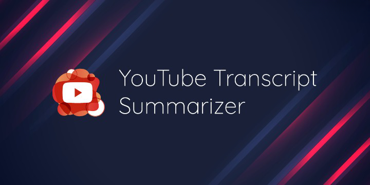

# YOUTUBE-TRANSCRIPT-SUMMARIZER




## Project Overview
Youtube transcript summarizer is a project designed with the help of web development and Machine Learning, this project aims to provide summarized content of a video in the form of transcripts by keeping all the important points and making it short and easily understandable. The summarized text can also be downloaded easily.

## Problem and Solution Statement
There's a lot of content on the youtube which is lengthy and does not contain any fruitful information which is the major issue. A lot of time is spent on watching these contents and end up getting no relevant information out of it, makes our time and efforts of no use. So this issue is resolved by a tool which can provide summarization of the video and therefore saves time.

## Implementation strategy
A chrome extension is being created which has an option to paste the copied URL of the video being selected. The link is being provided and it will access the transcript of the particular audio using the YouTube transcript API and then the transcript will be provided to a machine learning model that will in return provide the summarized text of the transcript. The summarized text would be downloadable by the user.

## Features

- Multiple Langauage Support (Hindi,English,Braille)
- Runtime Text to Speech Conversion (English language Only)
- Get Transcripts of videos of any length.
- Get Summarization of video of any language.
- Downloadable Transcripts.


## Installation

1. Install Anaconda by using this guide:-

https://github.com/Zen-o-Droid/YOUTUBE-TRANSCRIPT-SUMMARIZER/tree/main/Installing%20anaconda

2. Clone the repository in your local machine:-
```
git clone https://github.com/Zen-o-Droid/YOUTUBE-TRANSCRIPT-SUMMARIZER.git
```

3. To run the API, first set up a **Virtual Environment**. In order to do so, go into *youtube-transcript-summarizer-api* folder, open command prompt and paste the following command:-
```
python -m venv venv
```

4. After successfully setting up the Virtual Environment, it's time to install the **Dependencies**. Use the following command:-  
```
pip install -r requirements.txt
```

5. Now it's time to run the **API**:-
```
python app.py
```

6. Now the API is set up to provide the response. It's time to start with **frontend**. 


7. Go into *youtube-transcript-summarizer-frontend* folder by opening a new terminal and paste the following command:-
```
cd youtube-transcript-summarizer-frontend
```

8. Install all the required **node modules** with:-
```
npm install
```

9. Now you are all set to run the frontend.
```
npm start
```


## Authors

- [@Yogesh Kumar Singh](https://www.github.com/Zen-o-Droid)
- [@Shruti Singh](https://www.github.com/Shruti0999)
- [@Richa Sinha](https://www.github.com/Richa710)
